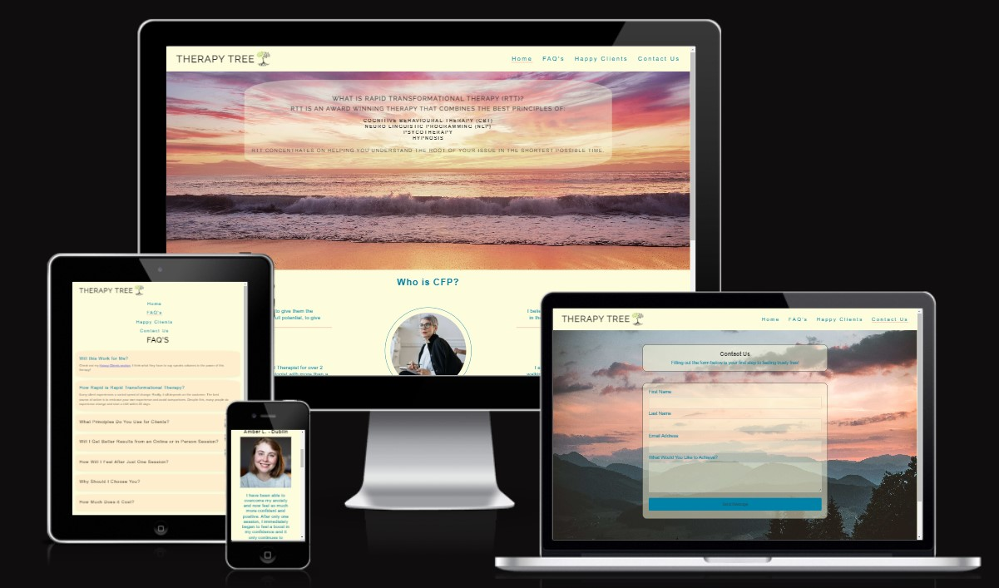
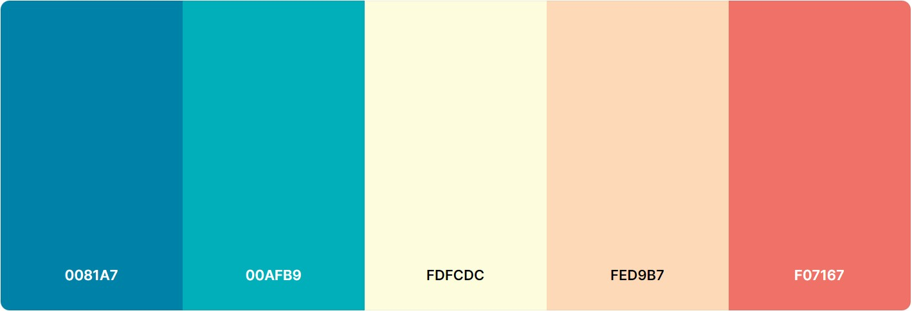

# THERAPY TREE Website

Therapy Tree - CFP is designed to be a responsive website allowing visitors to view on a range of devices. It's purpose is to educate visitors about what Rapid Transformational Therapy (RTT) is.

[View Therapy Tree Website on Github Pages](https://deanbert.github.io/therapytree-cfp/)

## CONTENT

* [User Experience (UX)](#User-Experience-(UX))
  * [Initial Discussion](#Initial-Discussion)
  * [User Stories](#User-Stories)

* [Design](#Design)
  * [Colour Scheme](#Colour-Scheme)
  * [Typography](#Typography)
  * [Imagery](#Imagery)
  * [Wireframes](#Wireframes)
  * [Features](#Features)
  * [Accessibility](#Accessibility)

* [Technologies Used](#Technologies-Used)
  * [Languages Used](#Languages-Used)
  * [Frameworks, Libraries & Programs Used](#Frameworks,-Libraries-&-Programs-Used)

* [Deployment & Local Development](#Deployment-&-Local-Development)
  * [Deployment](#Deployment)
  * [Local Development](#Local-Development)
    * [How to Fork](#How-to-Fork)
    * [How to Clone](#How-to-Clone)

* [Testing](#Testing)
  * [W3C Validator](#W3C-Validator)
  * [Solved Bugs](#Solved-Bugs)
  * [Known Bugs](#Known-Bugs)
  * [Testing User Stories](#Testing-User-Stories)
  * [Lighthouse](#Lighthouse)
    * [Index Page](#Index-Page)
    * [Books Page](#Books-Page)
    * [Contact Us Page](#Contact-Us-Page)
    * [Thank You Page](#Thank-You-Page)
  * [Full Testing](#Full-Testing)
  
* [Credits](#Credits)
  * [Code Used](#Code-Used)
  * [Content](#Content)
  * [Media](#Media)
  * [Acknowledgments](#Acknowledgments)

- - -

## User Experience (UX)

### Initial Discussion

Therapy Tree is an educational webpage thats primary focus is to educate its visitors on what rapid transformational therapy is and how it can help them. Visitors can also enquire on the website about booking a session.

#### Key information for the site

* What is RTT.
* How can it benefit you.
* How it will make you feel.
* Why should people come to us.
* How to book a session.

### User Stories

#### Client Goals

* To be able to view the site on a range of different device sizes.
* To make it easy for a potential customer to find out what RTT is.
* To answer any questions that potential customers may have.
* To allow people to be able to contact us to ask further questions or book a session.

#### First Time Visitor Goals

* I want to find out what is involved in Rapid Tranformational Therapy.
* I want to be able to navigate the site easily to find information.
* I want to be able to find their social media profiles.

#### Returning Visitor Goals

* I want to find up to date information on what RTT is offering.
* I want to be able to easily contact Therapy Tree with questions I might have.

#### Frequent Visitor Goals

* I want to be able to contact Therapy Tree to book sessions for subsequent issues.

- - -

## Design

### Colour Scheme

The website uses a palette of pastel style colours. The colour palette was created using the [Coolors](https://coolors.co/) website.

### Typography

Google Fonts was used for the following fonts:

* Raleway is used for headings on the site. It is a sans-serif font.

* Public-sans is used for the body text on the site. It is also a sans-serif font.  

* Arial is used for the paragraphs on the site. It too is a sans-serif font.

### Imagery

All images are royalty free, taken from either [Pexels](https://www.pexels.com/) the free stock photo site or from [Envato Elements](https://elements.envato.com/) from which I have a paid membership and have licences to use the images

### Wireframes

Wireframes were created for mobile, tablet and desktop using Balsamiq Wireframes.

[Wireframe](assets/images/responsive-wireframe.jpg)

### Features

The website is comprised of five pages, four of which are accessible from the navigation menu (Homepage, FAQ's page, Happy Clients page and a Contact us page). The fifth page is a thank you page which can only be seen once a user submits the form on the contact us page.

* All Pages on the website have:

  * A responsive nav bar in the header which allows the user to navigate through the site. In the left of the header is Therapy Tree text and logo. To the right of the header are the links to the websites pages (Home, FAQ's, Happy Clients and Contact Us). When viewing with mobile devices the navigation links change orientation to stack on top of one another. This was implemented to give the site a clean look and to promote a good user experience.

  * A footer which contains a link to social media sites: Instagram, Facebook, Twitter and YouTube. Icons were used to keep the footer clean and because they are universally recognisable.

* Home Page.
  * Landing Page.
  The first thing a user will see is an overview of RTT teaching them what it is.
  * About Me Section.
  This section is broken down into four subsections and gives users some information the therapist. On large screens the subsections are laid out in a row, however on mobile devices the subsections are stacked vertically.
  * Affirmations Section.
  This section is purely to promote positive vibes and make the user feel good.

* FAQ's Page.
  * Accordion Lists.
  The FAQ page uses accordions to clearly answer users questions while keeping the page tidy.
  Accordions were modified from Alvaro Trigo on Code Pen. [Alvaro-Trigo](https://codepen.io/alvarotrigo/pen/wvpwEdL)

* Happy Clients.
  A list of testimonials from real world cusotmers.

* Contact Us Page.
  * A request for the user to better get to know what it is they are looking for.
  * Form
  The form contains fields for the users name, First and Last, their email, and a text area for the user to add further information. The user submits the form using the send message button. All fields are mandatory, users must fill in their first name, last name, email and text area to be able to submit the form. If they don't a tooltip will guide them to fill in any information they have missed.

* Thank You Page.
  * A message thanks the user for submitting the form and lets them know someone will be in touch soon.
  
### Accessibility

I have been mindful during coding to ensure that the website is as accessible friendly as possible. I have achieved this by:

* Using semantic HTML.
* Using descriptive alt attributes on images on the site.
* Providing information for screen readers where there are icons used and no text - such as the review ratings for books & footer icons.
* Ensuring that there is a sufficient colour contrast throughout the site.
* Ensuring menus are accessible by marking the current page as current for screen readers.

- - -

## Technologies Used

### Languages Used

HTML and CSS were used to create this website.

### Frameworks, Libraries & Programs Used

Balsamiq Wireframs - Used to create wireframes.

Git - For version control.

Github - To save and store the files for the website.

Google Fonts - To import the fonts used on the website.

Font Awesome - For the iconography on the website.

Google Dev Tools - To troubleshoot and test features, solve issues with responsiveness and styling.

[Tiny PNG](https://tinypng.com/) To compress images.

[Font Awesome](https://fontawesome.com/search?o=r&m=free) To create icons.

[Am I Responsive?](http://ami.responsivedesign.is/) To show the website image on a range of devices.

[Shields.io](https://shields.io/) To add badges to the README

- - -

## Deployment & Local Development

### Deployment

Github Pages was used to deploy the live website. The instructions to achieve this are below:

1. Log in (or sign up) to Github.
2. Find the repository for this project, THERAPYTREE-CFP.
3. Click on the Settings link.
4. Click on the Pages link in the left hand side navigation bar.
5. In the Source section, choose main from the drop down select branch menu. Select Root from the drop down select folder menu.
6. Click Save. Your live Github Pages site is now deployed at the URL shown.

### Local Development

#### How to Clone

To clone the Bully-Book-Club repository:

1. Log in (or sign up) to GitHub.
2. Go to the repository for this project, deanbert/therapytree-cfp.
3. Click on the code button, select whether you would like to clone with HTTPS, SSH or GitHub CLI and copy the link shown.
4. Open the terminal in your code editor and change the current working directory to the location you want to use for the cloned directory.
5. Type 'git clone' into the terminal and then paste the link you copied in step 3. Press enter.

- - -

## Testing

Testing was ongoing throughout the entire build. I utilised Chrome developer tools while building to pinpoint and troubleshoot any issues as I went along.

Due to time difference, work commitments and my mentor needing surgery I was unable to have my mid project meeting with my mentor. We were able to squeeze in 2 sessions where I received some very helpful tips and information. After completing my project I had a call with my Cohort Lead Ernestas Ambrozas who very generously donated his time to help me with testing and bug triage. Some of the bugs found were:

* Duplicate padding in the Happy Client section which caused the page to be unresponsive on mobile devices.
* There was an issue on smaller devices where the cover text on the hero image was not displaying properly.
* The paragraph section of the about me page was not aligned in style with the rest of the page.
* The contact us paragraph of the contact us page was off center

The Following items were brought up when I submitted my site to my cohort lead for review on slack.

* Ernestas Ambrozas suggested to change to max-width in the about me section on the index page to make it more responsive as I was using a specific pixel width which was causing issues on smaller devices. This improved the flow of the page on smaller screens.
* Ernestas also suggested it would look better if the contact us form and details sections had the same padding giving them matching room on each side and were centred on the page. I adjusted the padding centred the entire section on the page and it now looks a lot better.

### Validation

The W3C validator was used to validate the HTML of the website. It was also used to validate CSS in the style.css file.

* [W3C HTML](assets/images/w3-html-checker.jpg)
* [style.css CSS](assets/images/w3-css-checker.jpg)

### Solved Bugs

1. The navbar would lose its alignment when on smaller devices, with the scattering in an unordered fashion and over to the left underneath the site logo. Once I added the correct class I was able to center the navbar on smaller devices allowing the navbar items go exactly where I wanted them.

2. Some of the affirmation images would dissapear when on smaller devices. I had forgotten to add a text-wrap to the affirmations container and a max-width to the images. Once I corrected this the images folded nicely underneath each other when on smaller devices.

3. The left and right about sections of the about me on the index page where very close to the edge of the screen making them almost dissapear. On a call with my cohort lead Ernestas Ambrozas he advised me to add a padding view width to the section which corrected it instantly and made more a much nicer UX.

4. The footer was displaying at the bottom of the screen as I had used a nav tag within the footer with the class fixed bottom. As I reviewed my code for errors I realised that there was no need for a nav tag to be used within the footer. When I removed this I had to add some additional styling to the style.css file to add a background colour and some padding to the footer.

5. When I asked for peer review on slack Anthony O'Brien pointed out that I was missing the container for the join us section on the home page. I had already added the css to style this section but had missed out putting the container class into the HTML. I have now added the container class to this section.

6. I could not get the thank you page to diplay correctly. The image was constantly a reduced size and the text display was off. After struggling with this for quite some time I mentioned it to Ernestas Ambrozas who told me that it was simply missing a height value and padding from my image. Adding those istantly resolved my issue.

### Known Bugs

1. Upon using W3C's CSS validator it threw up 2 width errors in cover text for my hero image and social media icons and unit error in my faq list. I amended these errors, or so I had thought, when I pushed my code and retested the same errors appeared again, which can be seen in the validator section above. Simply due to very tight time constraints I do not have the capacity to go in and fix it again

### Testing User Stories

* First Time Visitors
  * I want to find out what RTT is and if it is right for me.
  The cover text of the hero image as well as the FAQ section clearly outlines what RTT is.

  * I want to be able to navigate the site easily to find information.
  All site navigation is in the top navigation bar, which consistantly appears on all pages of the site. This navigation is responsive on smaller tablet and mobile devices.

  * I want to be able to find their social media pages.  
    Social media icons are clearly represented in the footer of each page. This opens a new browser window for a good user experience.

* Returning Visitors

  * I want to be able to easily contact someone with questions or concerns I might have.
  A contact us page provides a form that users can fill in to contact the us with any questions they might have. There is a text input area that allows the user to ask questions or tell us about themselves.

### Lighthouse

I used Lighthouse within the Chrome Developer Tools to allow me to test the performance, accessibility, best practices and SEO of the website.

[Lighthouse Desktop Testing](assets/images/lighthouse-desktop-score.jpg)
[Lighthouse Moblie Testing](assets/images/lighthouse-mobile-score.jpg)

### Full Testing

To fully test my website I performed the following testing using a number of browsers (google chrome, Gener8, Micrisoft Edge) and devices (Acer Travelmate P215-52, Samsung Galaxy S20 FE, Google Pixel 4).

I also went through each page using google chrome developer tools to ensure that they responsive on all different screen sizes.

Links.

1. Test each link on the index page. Each link worked as expected, and any links leading to external pages opened correctly in a seperate browser tab.
2. Test each link on the FAQ page. Each link worked as expected, and any links leading to external pages opened correctly in a seperate browser tab.
3. Test each link on the Happy Client page. Each link worked as expected, and any links leading to external pages opened correctly in a seperate browser tab.
4. Test each link on the Contact Us page. Each link worked as expected, and any links leading to external pages opened correctly in a seperate browser tab.
5. Test each link on the Thank You page. Each link worked as expected, and any links leading to external pages opened correctly in a seperate tab.

Contact Us Form.

1. Test the contact us form. I tried to submit the form without filling in any input fields, filling in only one input field, filling in a combination of only 2 input fields, filling in a combination of only 3 input fields. The form worked correctly each time and prevented users from continuing and prompted them to fill in the correct fields. I then filled out the necessary fields as instructed by the form and was able to submit, the form then opened the thank you page in the same browser window.

- - -

## Credits

### Code Used

* [Alvaro Trigo for the accordions in the FAQ section](https://codepen.io/alvarotrigo/pen/wvpwEdL)

### Content

Content for the website was written by Dean Fay.

### Acknowledgments

I would like to acknowledge the following people who helped me along the way in completing my first milestone project:

* [Malia Havlicek](https://github.com/maliahavlicek), My Code Institute Mentor.
* [Kera Cudmore](https://github.com/kera-cudmore) - For her webinar and information on read.me files.
* [Ernesto Ambrozas](https://github.com/eambrozas) - For his help with bug triage and for taking the time to properly explain things to me in a way that really helped me understand.